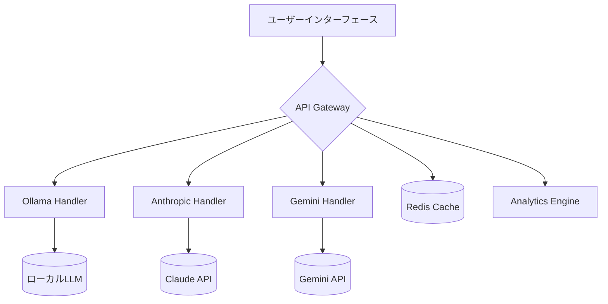

# MultiChat


## 概要
複数のAIキャラクターと同時に対話できる次世代チャットプラットフォーム。Ollama/Anthropic/Geminiを統合し、YAMLベースの動的設定でカスタマイズ可能。

## 🚀 クイックスタート

### 前提条件
- Node.js v20.3.1+
- Python 3.11.6+（分析機能利用時）
- Ollama v0.6.0+（ローカルLLM利用時）

```bash
# リポジトリのクローンと依存関係インストール
git clone https://github.com/Nyukimin/MultiChat
cd MultiChat
npm install
```

### 環境設定
`.env.local` ファイルを作成：
```ini
# 必須設定
NEXT_PUBLIC_OLLAMA_BASE_URL="http://localhost:11434"
NEXT_PUBLIC_ANTHROPIC_API_KEY="sk-ant-api03-..."
NEXT_PUBLIC_GEMINI_API_KEY="AIzaSyA7aSuSGw..."

# オプション設定
NEXT_PUBLIC_DEBUG_MODE="false"
NEXT_PUBLIC_CHAT_HISTORY_MAX="10"
```

### 開発サーバー起動
```bash
npm run dev
```
http://localhost:3000 にアクセス

## 📂 設定ファイル体系

### AIプロバイダー設定 (`config/providers/`)
| ファイル名          | 説明                     | 主要パラメータ例       |
|----------------------|--------------------------|------------------------|
| `ollama.yaml`       | ローカルLLM設定          | endpoint, model_list   |
| `anthropic.yaml`    | Claudeモデル設定         | api_key, model_version |
| `gemini.yaml`       | Geminiプロ設定           | project_id, location   |

例）`ollama.yaml`:
```yaml
models:
  - name: "phi-4-deepseek"
    base_model: "hf.co/mradermacher/phi-4-deepseek-R1K-RL-EZO-GGUF"
    parameters:
      temperature: 0.7
      max_tokens: 1024
    safety_filters:
      - category: "HARM_CATEGORY_DANGEROUS"
        threshold: "BLOCK_ONLY_HIGH"
```

### ユーザー管理 (`config/users/`)
| ファイル名                | 用途                     | 主要フィールド         |
|---------------------------|--------------------------|------------------------|
| `default_user.json`       | 新規ユーザーテンプレート | preferences, access_rules |
| `system_users.json`      | システムアカウント定義   | service_account, api_keys |
| `user_config_template.json` | カスタムユーザーテンプレ | custom_fields         |

例）`default_user.json`:
```json
{
  "user_profile": {
    "theme": "dark",
    "response_speed": 5,
    "default_character": "assistant"
  },
  "access_control": {
    "allowed_providers": ["ollama", "anthropic"],
    "rate_limit": "100/hour"
  }
}
```

## 🏗️ システムアーキテクチャ



## 🔧 技術構成

| カテゴリ       | 技術スタック             | バージョン | 用途                     |
|----------------|--------------------------|------------|--------------------------|
| フロントエンド | Next.js                 | 15.1.6     | アプリケーション基盤     |
| 状態管理       | Zustand                 | 4.5.3      | グローバル状態管理       |
| UIコンポーネント | shadcn/ui              | 0.9.4      | 統一デザインシステム     |
| APIクライアント | Axios                  | 1.6.2      | HTTP通信処理            |
| 設定管理       | js-yaml                 | 4.1.0      | YAMLパーサー            |

```json
// package.json 主要依存関係
{
  "dependencies": {
    "@anthropic-ai/sdk": "^0.36.3",
    "@google/generative-ai": "^0.21.0",
    "ioredis": "^5.5.0",
    "js-yaml": "^4.1.0",
    "next": "15.1.6",
    "react": "^19.0.0",
    "zustand": "^4.5.3"
  }
}
```

## 🖥️ 使用方法

1. **キャラクター選択**
   - 画面右上のドロップダウンから最大3キャラを選択

2. **質問入力**
   ```markdown
   [システムプロンプト]
   日本の経済状況について、各キャラクターの専門分野に基づいて分析してください
   ```

3. **レスポンス監視**
   - リアルタイムストリーミング表示
   - 応答速度インジケーター（1-5段階）

4. **履歴管理**
   - 自動保存（最大10件）
   - エクスポート機能（JSON/Markdown）

## 🛠️ メンテナンス

### 常用コマンド
```bash
# 環境変数検証
npm run check:env

# API接続テスト
npm run test:api

# キャッシュクリア
npm run clear:cache
```

### トラブルシューティング
| 現象                     | 対応方法                          |
|--------------------------|-----------------------------------|
| API接続エラー           | 1. ファイアウォール設定確認<br>2. `.env`設定再確認 |
| ストリーミング遅延       | `NEXT_PUBLIC_CHAT_SPEED`値を調整  |
| キャラクター読み込み失敗 | `config/providers/`ファイル検証   |

## 📄 ライセンス
MIT License - 詳細は[LICENSE](LICENSE)ファイルを参照

## 🤝 貢献方法
1. リポジトリをフォーク
2. 機能ブランチ作成 (`git checkout -b feature/amazing-feature`)
3. 変更をコミット (`git commit -m 'Add amazing feature'`)
4. プッシュ (`git push origin feature/amazing-feature`)
5. プルリクエスト作成

---

> **Note**  
> 実際のスクリーンショットは[public/screenshot.png]を参照  
> 本番環境デプロイ時は`npm run build`を実行
